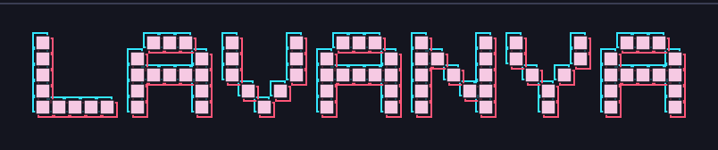

<!-- ============================================================ -->
<!--                     HEADER / BANNER IMAGE                    -->
<!-- ============================================================ -->

  

<!-- ============================================================ -->
<!--                      PROFILE VIEW COUNTER                    -->
<!-- ============================================================ -->

---

<!-- ============================================================ -->
<!--                     GREETING / INTRO TITLE                   -->
<!-- ============================================================ -->

<h1 align="center">
  
  
    Hi there,  I'm Lavanya
  
</h1>

---

<!-- ============================================================ -->
<!--                      SOCIAL MEDIA LINKS                      -->
<!-- ============================================================ -->

<h3 align="center">🌐 Connect with me</h3>

<table align="center">
  <tr>
    <td align="center">
      
    </td>
  </tr>
</table>

---

<!-- ============================================================ -->
<!--                         ABOUT ME SECTION                     -->
<!-- ============================================================ -->

## &nbsp;&nbsp; About Me

Computer Science student passionate about building real-world software and continuously learning new technologies.

I work across:

- 💻 Web Development
- ☕ Java Programming
- 📚 Academic & Coursework Projects
- 🌱 Exploring new tools and frameworks

to build practical, well-documented projects with a focus on learning and steady improvement.
- 🎓 **Degree:** B.Tech in Computer Science (CSE)
- 📧 **Open to:** Collaborations and Open Source Opportunities

---
<!-- ============================================================ -->
<!--                        TECH STACK TABLE                      -->
<!-- ============================================================ -->

## 🧰 My Tech Stack

<table>
  <tr>
    <th>Programming Languages</th>
    <th>Markup &amp; Styling</th>
    <th>IDEs / Editors</th>
    <th>Tools / Platforms</th>
  </tr>
  <tr>
    <!-- Programming Languages -->
    <td align="center">
      
      
      
      
    </td>
    <!-- Markup & Styling -->
    <td align="center">
      
      
    </td>
    <!-- IDEs / Editors -->
    <td align="center">
      
      
    </td>
    <!-- Tools / Platforms -->
    <td align="center">
      
      
      
      
    </td>
  </tr>
</table>

---
<!-- ============================================================ -->
<!--                     GITHUB STATS CARDS                       -->
<!-- ============================================================ -->

### 📊 GitHub Stats & Activity

  
  
  
  

<!-- Divider -->

  

<!-- ============================================================ -->
<!--               STREAK STATS & TOP LANGUAGES                   -->
<!-- ============================================================ -->

<table>
  <tr>
    <!-- GitHub Streak -->
    <td align="center">
      
    </td>
    <!-- Top Languages -->
    <td align="center">
      
    </td>
  </tr>
</table>

<!-- Divider -->

  

<!-- ============================================================ -->
<!--                    ACTIVITY GRAPH                            -->
<!-- ============================================================ -->

  

<!-- ============================================================ -->
<!--                    SNAKE CONTRIBUTION GRAPH                  -->
<!-- ============================================================ -->

### 🐍 Contribution Snake

  

<!-- Divider -->

  

---

<!-- ============================================================ -->
<!--                          PROJECTS                             -->
<!-- ============================================================ -->

## 📌 Featured Repositories

| Repository | Description | Language |
|---|---|---|
| [Cognitive](https://github.com/lavanya835/Cognitive) | Cognitive Authentication project | HTML |
| [Blood-Group-Web](https://github.com/lavanya835/Blood-Group-Web) | Blood group web app | CSS |
| [portfolio](https://github.com/lavanya835/portfolio) | Personal portfolio website | JavaScript |
| [23bcs13676_lavanya_Project](https://github.com/lavanya835/23bcs13676_lavanya_Project) | Academic project | Java |
| [23bcs13676_lavanya_3.2_exp](https://github.com/lavanya835/23bcs13676_lavanya_3.2_exp) | Coursework experiment | — |

---

<!-- ============================================================ -->
<!--                         FUN FACT / FOOTER                    -->
<!-- ============================================================ -->

## ⚡ Fun Facts & Vibes

> 💻 Always learning something new
> 📚 Curious about how things work under the hood
> ☕ Coffee-powered coding sessions

  **💡 Let's Connect & Innovate Together! 🌟**

  

<!-- Footer Animation -->

  

